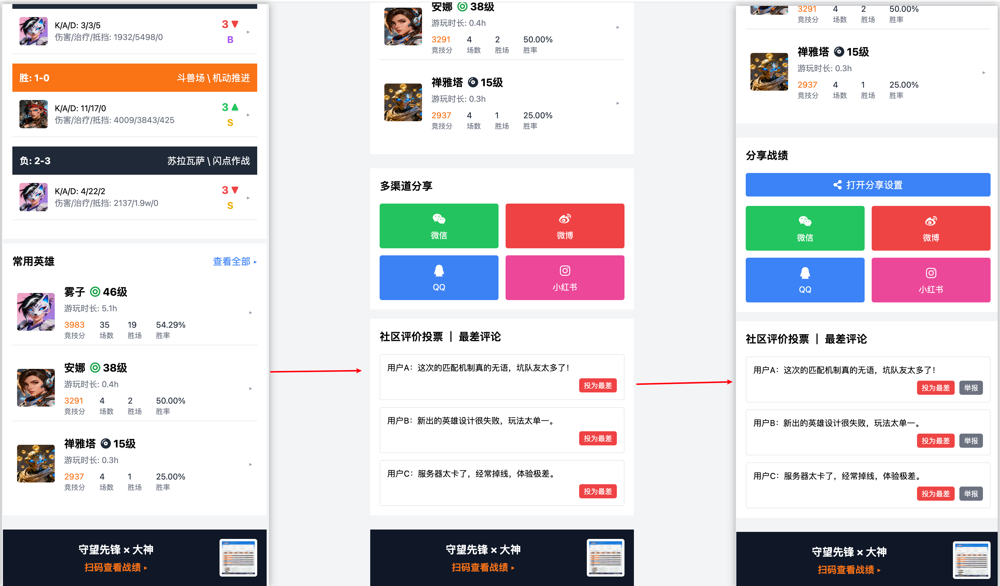
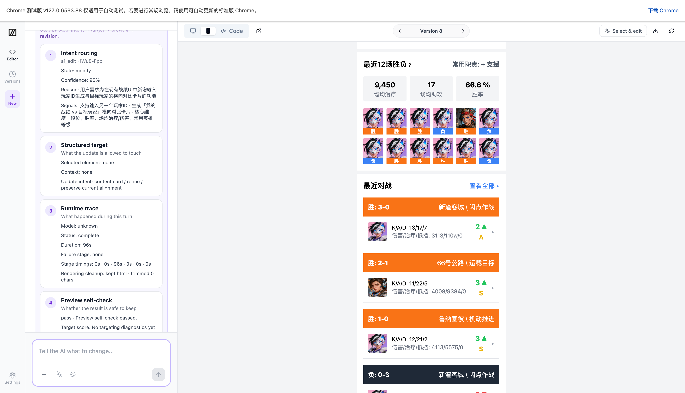

# screenshot-to-code-agent

这是一个基于 [abi/screenshot-to-code](https://github.com/abi/screenshot-to-code) 继续演进出来的定制分支。

我们保留“截图 / 文本 / 参考图 -> 生成 UI”的底层能力，但把重点改成了更像一个能持续工作的设计 Agent：

- 不是一次性出图，而是围绕同一主稿持续修改
- 不是整页重画，而是支持点选元素后局部命中
- 不是生成完就结束，而是先做预览自检和失败诊断
- 不是把所有状态丢掉，而是保留工作区和历史
- 不是黑盒体验，而是把调试、QA、意图路由都露出来

## 演示图

先看成品，再看工作流。

| 成品图 | 过程图 |
| --- | --- |
|  |  |

这两张图可以直接放在 README 首屏，读的人一眼就能明白：

- `game.png` 是我们最终想交付的竖版战绩页
- `ui_image.png` 是我们在生成、调试、迭代时的工作界面

## 能力面板

| 能力 | 当前状态 | 作用 |
| --- | --- | --- |
| 单主稿生成 | 已接入 | 优先产出一个可继续迭代的主版本 |
| 局部编辑 | 已接入 | 点选元素后只改局部，提高二次命中率 |
| 预览自检 | 已接入 | 先检查可渲染性、可见性、报错信息 |
| 工作区持久化 | 已接入 | 刷新、重开后可恢复上次上下文 |
| Agent Debug 面板 | 已接入 | 查看意图、计划、调用链、异常细节 |
| QA 面板 | 已接入 | 观察命中率、失败率、耗时、回滚情况 |
| 可渲染 root 清理 | 已接入 | 只保留首个可渲染输出，其余进诊断区 |
| 意图路由 | 已接入 | 生成、修改、修复、提问走不同路径 |
| 参考型联网检索 | 已接入 | 对参考说明做检索增强，提升对齐度 |

## 这版和原版不一样的地方

原版更像“截图到代码工具”。
这版更像“能连续干活的 UI 生成 Agent”。

我们做的不是换个壳，而是把工作方式换掉了：

1. 先出一版主稿，再围绕同一稿持续迭代
2. 先判断用户意图，再决定是生成、局部修改还是修复
3. 先做可渲染性和自检，再把结果交给用户
4. 先保留工作区状态，再谈恢复和回滚
5. 先把调试信息和 QA 数据露出来，再谈质量提升

## 生成链路

```text
截图 / 文本 / 参考图
        ->
   意图路由
        ->
   单主稿生成
        ->
   局部编辑 / 修复
        ->
   预览自检
        ->
   QA / Debug 面板
```

## 我们想解决的事

- 竖版 app / 手机端页面不好看，不能只靠“能生成”来掩盖布局问题
- 生成结果必须能继续改，而不是每次都推倒重来
- 用户二次修改时，命中率要明显高于“粗暴重画”
- 出问题时要能定位，不要只剩一个笼统失败提示

## 本地启动

### 1. 后端

```bash
cd backend
cp .env.example .env
```

把模型配置填进 `backend/.env`。

如果你的文本模型和图片模型不是同一家，可以分开配：

```bash
OPENAI_API_KEY=your_text_or_compat_key
OPENAI_BASE_URL=https://your-text-provider.example/v1
OPENAI_MODEL=your-text-model

OPENAI_IMAGE_MODEL=your-image-model
OPENAI_IMAGE_SIZE=1K
OPENAI_IMAGE_STREAM=false
OPENAI_IMAGE_SEQUENTIAL_IMAGE_GENERATION=disabled
OPENAI_IMAGE_WATERMARK=true
```

然后启动：

```bash
poetry install
poetry run playwright install chromium
poetry run uvicorn main:app --reload --port 7001
```

### 2. 前端

```bash
cd frontend
yarn
yarn dev
```

打开：

- `http://localhost:5173`

如果后端地址不是默认值，再调整 `frontend/.env.local` 里的：

- `VITE_HTTP_BACKEND_URL`
- `VITE_WS_BACKEND_URL`

## 输入类型

这个项目支持两类输入：

- 截图 / 参考图
- 文本 brief

如果你要做“图片二次更新”或“局部视觉修改”，建议先点选目标元素，再提交修改说明，这样更容易命中。

## 模型配置建议

如果你用的是 OpenAI-compatible 接口，通常只需要把这几项配好：

```bash
OPENAI_API_KEY=...
OPENAI_BASE_URL=...
OPENAI_MODEL=...
```

如果文本和生图来自不同供应商，也可以继续拆开配，文本走一套，图片走另一套。

## 项目定位

这版仓库的目标不是“再做一个一次性生成器”，而是做一个能连续工作的设计 Agent 雏形：

- 先生成可见主稿
- 再连续改
- 改动可解释
- 失败有诊断
- 结果可回滚
- 历史可恢复

## 说明

- 这不是上游仓库的原样 README
- 文案、功能描述、演示视频都应该以我们自己这版为准
- 演示图片目前直接引用仓库根目录的 `game.png` 和 `ui_image.png`
